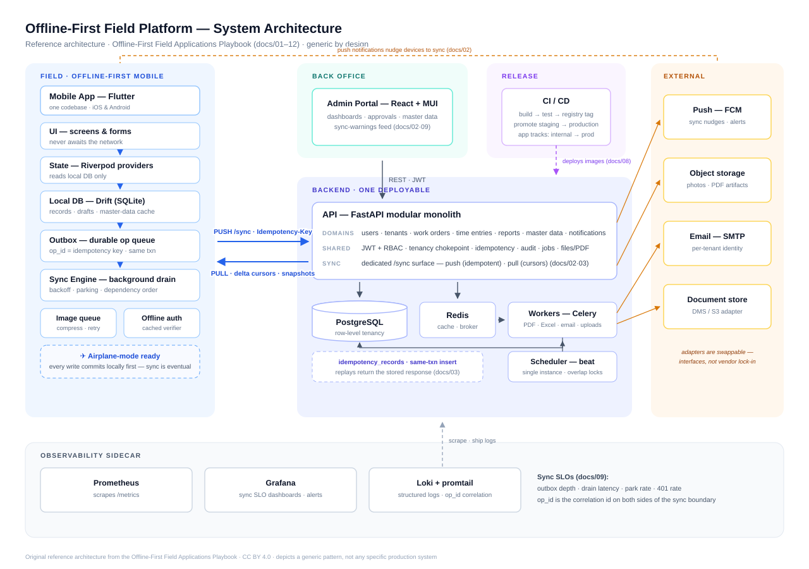

# Seamless Offline Architecture — An Engineering Playbook for Field Applications

**Patterns, protocols, and hard-won lessons for building field-service software that works with zero connectivity.**

Field engineers work in basements, on rooftops, at remote industrial sites, and inside metal enclosures where connectivity ranges from flaky to nonexistent. Software built for them cannot treat "offline" as an error state — offline is the *normal* state, and the network is an optimization.

This repository is my engineering playbook for that class of application: a full-stack architecture (API backend + admin web portal + offline-first mobile app) and the specific mechanisms — durable outboxes, end-to-end idempotency, per-data-class sync policies, conflict handling, observability — that make it hold up in production.

> **Provenance & disclaimer.** This is a personal knowledge project. The patterns here generalize lessons from production field-service systems I have designed, built, and operated professionally. It contains **no proprietary source code** — every example, diagram, schema, and code sketch is original and generic. It is not affiliated with or endorsed by any employer or client.

---

*The full system at a glance — each zone maps to a playbook doc. Deeper diagrams (outbox lifecycle, sync state machine, pipelines) are embedded in the docs as Mermaid and render directly on GitHub.*

## Who this is for

Engineers building (or rescuing) apps where users must **create real business records without connectivity** — work orders, inspection reports, timesheets, delivery confirmations — and where losing a single record costs real money and trust. Most of it applies equally to any occasionally-connected mobile system.

## The reference domain

All examples use a deliberately generic field-service domain:

| Concept | Meaning |
|---|---|
| **Tenant / Region** | An operating company or country unit; data is scoped per tenant |
| **Work order** | A job assigned to one or more field engineers |
| **Time entry** | Hours logged against a work order |
| **Service report** | A structured multi-page report with photos and signatures |
| **Delivery note** | A signed confirmation of delivered goods/materials |
| **Master data** | Reference tables (customers, sites, equipment, price lists) owned by the back office |

## Contents

| # | Document | One-liner |
|---|---|---|
| 01 | [Architecture overview](docs/01-architecture-overview.md) | The three-tier shape: modular-monolith API, admin web, offline-first mobile — and why |
| 02 | [Offline-first sync](docs/02-offline-first-sync.md) | The core: durable outbox, sync directionality per data class, drain lifecycle, failure modes |
| 03 | [End-to-end idempotency](docs/03-idempotency-end-to-end.md) | Exactly-once *effects* on an at-least-once network; where duplicate bugs actually come from |
| 04 | [Multi-tenancy & RBAC](docs/04-multi-tenancy-rbac.md) | Tenant scoping, layered permission inheritance, and per-tenant configuration |
| 05 | [Offline document numbering](docs/05-offline-document-numbering.md) | Human-readable business codes minted on devices that are offline — without collisions |
| 06 | [Background jobs](docs/06-background-jobs.md) | Job-queue patterns and the failure modes that take production down |
| 07 | [PDF & spreadsheet pipeline](docs/07-pdf-excel-report-pipeline.md) | Turning structured reports into pixel-faithful PDFs and Excel exports at scale |
| 08 | [Mobile release engineering](docs/08-mobile-release-engineering.md) | Signing, staged rollout tracks, versioning discipline, and schema-migration safety |
| 09 | [Observability for sync systems](docs/09-observability-for-sync-systems.md) | What to measure when "it synced… probably" isn't good enough |
| 10 | [Security checklist](docs/10-security-checklist.md) | Secrets hygiene, token lifecycles, and the classic self-inflicted wounds |
| 11 | [Legacy data migration playbook](docs/11-legacy-data-migration-playbook.md) | Moving years of production data out of a legacy system — with parity proofs |
| 12 | [Reference implementation spec](docs/12-demo-project-spec.md) | The blueprint for a runnable open-source demo of everything above |

Each document stands alone; together they describe one coherent system.

## The ten opinions this playbook defends

1. **Offline is the default, not the exception.** Design every mobile write path as if the network does not exist; treat successful sync as eventual.
2. **A durable outbox beats clever retries.** Local commit first, background drain second, UI truth = local DB.
3. **Idempotency keys are minted exactly once, at user intent.** Every duplicate-record bug I have ever debugged reduced to a key being re-minted or dropped.
4. **Not all data syncs the same way.** Reference data pulls, engineer-owned records push, shared records need bidirectional rules. Naming the policy per data class kills a whole category of conflicts.
5. **The server is authoritative for state, the device for intent.**
6. **Business codes are not database IDs.** Human-readable document numbers need their own minting discipline, especially offline.
7. **Every background side-effect must be idempotent and observable**, because it *will* be retried.
8. **Sync needs SLOs.** Outbox depth, drain latency, and auth-failure rate are product metrics, not infrastructure trivia.
9. **Schema migrations on-device deserve the same fear as server migrations.** A failed mobile migration is a fleet-wide incident you cannot roll back.
10. **Boring, inspectable mechanisms win.** A table you can query beats an opaque sync framework when a technician's week of timesheets is on the line.

## How this playbook was written

I work with an AI-accelerated workflow: these documents were drafted and refined with AI assistance (Claude), working from my own production experience building and operating an offline-first field platform — the architecture choices, failure stories, and opinions are mine, and so is the accountability for them. I use the same division of labor when I write software: AI for drafts and drudgery; design, review, verification, and final decisions on me.

## Roadmap

- [x] Playbook (this repository)
- [ ] **Reference implementation** per [docs/12](docs/12-demo-project-spec.md): FastAPI + PostgreSQL + Redis backend, Flutter offline-first app, React admin — built from scratch with seeded demo data
- [ ] Postman/HTTP collection for the sync protocol
- [ ] Load-test harness for the outbox drain path

## License

Text and diagrams: [CC BY 4.0](LICENSE.md). Code sketches within the docs: MIT, per the note in [LICENSE.md](LICENSE.md). Attribution appreciated.
