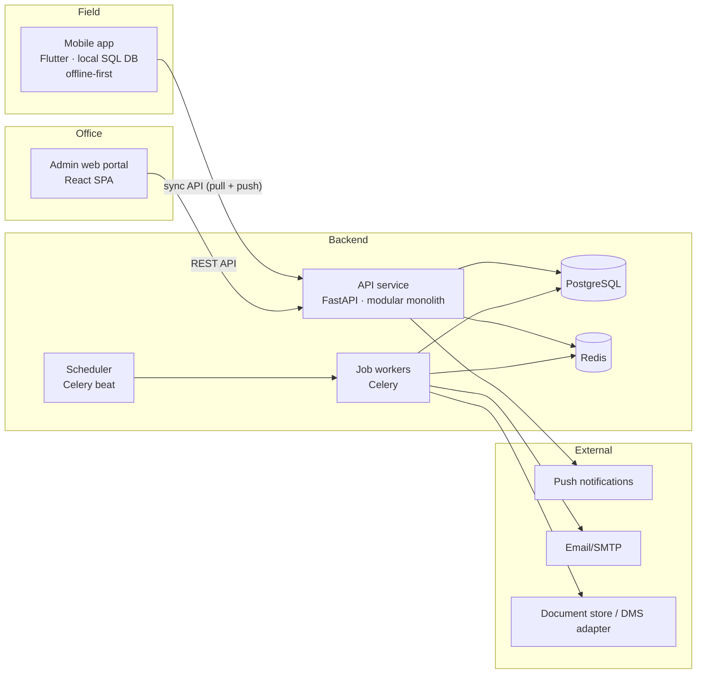

# 01 — Architecture Overview

*The shape of a field-service platform that survives real field conditions.*

## The system at a glance



Three clients-worth of complexity, one backend. The interesting engineering lives in two places: the **sync boundary** between mobile and API (docs [02](02-offline-first-sync.md)/[03](03-idempotency-end-to-end.md)) and the **asynchronous side-effects** behind the API (doc [06](06-background-jobs.md)).

## Why a modular monolith (and not microservices)

A field-service platform for a mid-size operation has perhaps a dozen domains — users, tenants, roles, work orders, time entries, reports, notifications, dashboards, master data. The team building it has perhaps two to five engineers.

A **modular monolith** — one deployable API with strictly separated domain packages — fits that reality:

```
api/
├── apps/                    # one package per business domain
│   ├── users/               #   api.py · models.py · schemas.py · services.py
│   ├── tenants/
│   ├── work_orders/
│   │   └── sync_api.py      #   the mobile sync surface is its own module
│   ├── time_entries/
│   ├── reports/
│   ├── master_data/
│   ├── notifications/
│   └── dashboard/
├── shared/                  # cross-cutting platform layer
│   ├── auth.py              #   JWT issuing/validation, RBAC decorators
│   ├── audit.py             #   who-did-what log, one interceptor
│   ├── idempotency.py       #   see doc 03
│   ├── jobs.py              #   task-queue helpers
│   └── files.py             #   uploads, image processing
└── main.py                  # router registration only
```

Rules that keep it from rotting:

1. **Domains talk through service functions, not each other's tables.** `reports.services.create_report()` may call `work_orders.services.get_work_order()`; it may not join `work_orders` tables directly.
2. **The `shared/` layer has no business logic.** If it knows what a work order is, it's in the wrong place.
3. **The mobile sync surface is a separate module per domain** (`sync_api.py`), not extra parameters on the web endpoints. Mobile sync has different auth lifetimes, batching, and idempotency requirements; mixing the two surfaces couples things that change for different reasons.

You get microservice-shaped boundaries with monolith-shaped operations: one deploy, one database, transactions across domains when you legitimately need them.

## The mobile app is a different animal

The web portal is a normal SPA: request/response, server is truth, spinner on slow network. The mobile app inverts every one of those assumptions:

| | Admin web | Field mobile |
|---|---|---|
| Source of truth for UI | Server response | **Local database** |
| Network | Assumed present | Assumed absent |
| Writes | Direct API call | **Local commit → outbox → background drain** |
| Auth session | Short-lived, interactive re-login fine | Must survive **weeks offline** (doc 10) |
| Failure UX | Error toast, retry button | **No failure UX for writes** — the write always succeeds locally |

The mobile stack that supports this: a typed local SQL database (e.g. Drift/SQLite on Flutter), a state-management layer that reads *only* from the local DB (e.g. Riverpod providers watching queries), and a sync engine that reconciles local ↔ server in the background. The UI never awaits the network for a write. Ever.

## Data-class map

Every table in the system gets classified once, up front. This single table is the most valuable design artifact in the whole platform (expanded in doc 02):

| Data class | Examples | Owner | Sync direction | Conflict policy |
|---|---|---|---|---|
| Master data | customers, sites, equipment | Back office | Server → mobile (pull) | Server always wins |
| Assignments | work orders | Back office creates, engineer executes | Bidirectional | Field-status: engineer wins; definition: office wins |
| Engineer-owned records | time entries, inspection reports, dispatch records | Engineer | Mobile → server (push) | Device wins until submitted; locked after approval |
| Config | tenants, roles, permissions | Admins | Server → mobile (pull) | Server always wins |

## Multi-tenant from day one

Operating companies in different countries share one deployment. Every business row carries a `tenant_id`; every query path is tenant-scoped by construction (doc 04). Retrofitting tenancy later is a rewrite — this is a decision to get right before the first table exists.

## Deployment shape

Docker Compose (or equivalent) with: `api`, `postgres`, `redis`, `worker`, `scheduler`, and a static-serving container for the web build. Images promoted through registry tags (`staging` → `production`), never rebuilt between environments — the image you tested is the image you ship (doc 08 covers the mobile analog; doc 09 the monitoring sidecar stack).

## What I would *not* do again

- **Skip automated tests to move faster early.** The sync engine is exactly the kind of combinatorial logic (offline × retry × conflict × auth-expiry) where manual testing lies to you. The reference implementation (doc 12) budgets tests from commit one.
- **Let any endpoint return unbounded lists.** Field tenants accumulate tens of thousands of work orders per year; pagination retrofits are miserable.
- **Allow "temporary" wide-open CORS or default credentials to survive past the first sprint.** Doc 10 is the checklist I wish had been enforced from the start.
