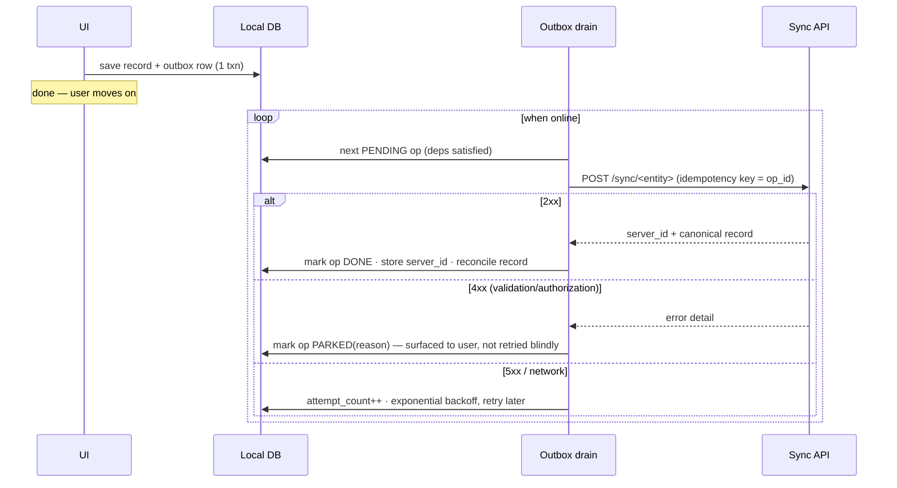
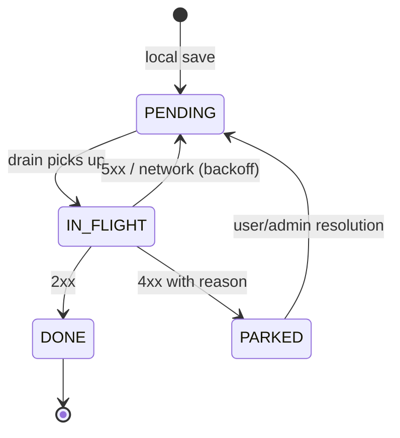

# 02 — Offline-First Sync

*The core mechanism: how records created in a basement reach the server days later, exactly once, in the right order.*

## Design goals

1. **Zero data loss.** A record saved on the device is never lost — not by crash, not by retry, not by re-login, not by app update.
2. **No user-facing sync ceremony.** Engineers tap Save and move on. Sync is background behavior with visible status, not a workflow step.
3. **Deterministic recovery.** Any device state — however weird — must be explainable from queryable local tables, and recoverable without "clear data and re-login" (which is how field data dies).
4. **Server remains authoritative** for shared state; the device is authoritative for the engineer's *intent*.

## The foundation: local commit + durable outbox

Every write on the device is two inserts in **one local transaction**:

```
BEGIN;
  INSERT INTO time_entries (...);                  -- the record, usable immediately
  INSERT INTO outbox (op_id, entity_type, entity_local_id,
                      operation, payload, depends_on, created_at,
                      state, attempt_count)
       VALUES (...);                               -- the intent to sync it
COMMIT;
```

The UI reads the record from the local table instantly — the network is not consulted. A background **drain loop** walks the outbox whenever connectivity exists:



### Outbox rules that matter

- **`op_id` is the idempotency key** and is minted exactly once, when the row is created (doc 03). Retries reuse it verbatim.
- **Ordering is per-entity-chain, not global.** A delivery note that references a time entry declares `depends_on`; the drain never sends a child before its parent has a `server_id`. Independent chains drain in parallel.
- **Distinguish retryable from parked.** 5xx/network → backoff and retry forever. 4xx → *park* the op with a reason and show it in a sync-status screen. Blind-retrying a 422 burns battery and hides bugs; silently dropping it loses data. Parking with visibility does neither.
- **Parked ops must be revivable.** Every parked reason needs a resolution path (re-auth, edit + resubmit, admin fix server-side + retry). An op state with no exit is a data-loss bug with extra steps — audit the state machine for absorbing states.
- **The outbox is user-visible.** A "pending uploads" count with per-item status turns "the app lost my report!" into "it says waiting for network — ok."

### The op state machine



Two audits to run on any implementation: (a) no transition loses the payload; (b) no state is absorbing except DONE.

## Sync directionality: one policy per data class

The single most clarifying decision in the whole system — classify every table once (see doc 01) and encode the policy in code, not tribal knowledge:

### Pull-only (master/reference data)

Customers, sites, equipment, price lists, form templates. Server wins, always; devices never write.

The trap here is **partial application**: applying a half-downloaded master dataset leaves the device internally inconsistent (a work order referencing a site the device doesn't have yet). Two patterns avoid it:

- **Transactional swap:** download the full changed set, apply in one local transaction (or to a shadow table, then rename). The device is always on a *complete* snapshot version.
- **Versioned snapshots + deltas:** each pull returns `(snapshot_version, changes)`; the device records the version it is on, and the server can answer "everything since v".

Soft-deletes propagate as data (`is_deleted` flags), not as absences — you cannot diff what isn't there.

### Push-only (engineer-owned records)

Time entries, service reports, delivery notes. Devices create; the server accepts, validates, assigns server identity, and never edits content — subsequent workflow (approval, locking) changes *status*, not substance.

The trap: **the server quietly normalizing/correcting payloads**, which makes device and server copies drift and turns every later comparison into a mystery. Validate hard, reject clearly, park visibly — don't "fix" silently.

### Bidirectional (shared records)

Work orders: created and edited by the office, status-advanced and annotated by engineers. This is the only class where true conflicts exist, so keep the writable surface *per side* as small as possible:

- Office owns the definition fields (description, site, schedule).
- Device owns the execution fields (field status, completion notes, attachments).
- Non-overlapping field ownership = most "conflicts" become merges.
- For the residual overlaps, pick per-field: last-writer-wins with server timestamps, or engineer-wins-until-submitted. Write the choice down in the data-class map.

**Deletions deserve special respect:** if the office deletes a work order that a device has offline drafts against, don't cascade-delete the drafts on next sync. *Park* the orphaned drafts in a visible "needs attention" area — the engineer's captured data survives the office's tidy-up, and someone decides deliberately.

## The pull side: delta cursors

Devices pull changes with a cursor (`updated_since` watermark or server-issued opaque cursor). Hard-learned rules:

- **The server issues the next cursor**; the device never computes it from local clocks. Client clocks lie.
- **Cursor advancement must be atomic with applying the batch.** Advance-then-crash = a permanently skipped window of changes; apply-then-fail-to-advance = harmless re-application (make application idempotent — upserts by server id).
- **A poisoned cursor needs an escape hatch:** a "full resync this table" operation that rebuilds from snapshot without touching engineer-owned local records. When a cursor bug ships, this is the difference between a support script and a fleet re-onboarding.

## Auth across weeks of offline

Field tokens expire while devices are offline — design for it explicitly (details in doc 10):

- Refresh **proactively on any online activity** with a generous buffer (refresh when, say, less than half the lifetime remains — not in the last minutes), because the next opportunity may be days away.
- If a drain hits 401: pause the queue, attempt refresh, resume. **Never park business ops on auth failures** — auth is a queue-level condition, not an op-level verdict. Ops parked on a transient 401 have a habit of never being revived; treat "parked-by-auth" as a state that auto-revives on successful login, and audit for it.
- Offline login: cache a password verifier locally so the engineer can *open the app* and keep working; queue everything as usual.

## Sync status as a first-class feature

Three surfaces earn their keep:

1. **Device:** per-record chips (pending / syncing / synced / needs attention) driven directly off outbox state — never a separate "status" field that can drift from the queue's truth. Mislabeled chips destroy trust faster than slow sync.
2. **Server:** a *sync warnings* feed for the back office — payloads rejected, conflicts parked, devices not seen for N days. Field problems become visible before the month-end report crunch.
3. **Ops:** metrics — outbox depth, drain latency, park rate, auth-failure rate (doc 09).

## Failure modes I now test for explicitly

| Failure | Mechanism that catches it |
|---|---|
| App killed mid-drain | Op stays IN_FLIGHT with a lease timeout → returns to PENDING; server dedupes the retry by `op_id` |
| Same record submitted twice online (double-tap, impatient re-submit) | Idempotency key minted at intent-time (doc 03) + a client-side in-flight guard on the Save button |
| Token expired mid-queue | Queue-level pause/refresh/resume; no per-op parking on 401 |
| Server deleted the parent of local drafts | Orphan-parking, human resolution — never cascade-delete intent |
| Cursor bug skips changes | Server-issued cursors + atomic apply + full-resync escape hatch |
| Partial master-data apply | Snapshot swap in one transaction |
| Op parked with no exit path | State-machine audit: DONE is the only absorbing state |
| "Synced" chip on an unsynced record | Chips derive from outbox state, single source of truth |

## What I'd tell someone building this for the first time

Build the outbox and the state machine first, with tests, before any feature uses them. Every record type you add later inherits its guarantees for free — and every shortcut you take here you will pay for one lost-timesheet incident at a time.
