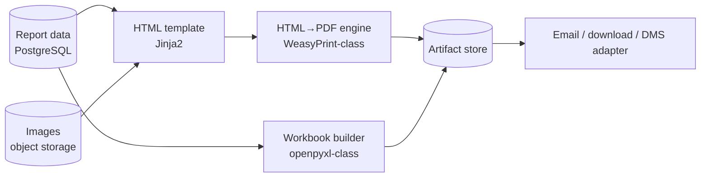

# 07 — PDF & Spreadsheet Report Pipeline

*A field platform is, to the back office, a machine that turns taps and photos into signed PDFs and month-end spreadsheets.*

## Shape of the pipeline

Rendering runs as background jobs (doc 06): idempotent (same report id → overwrite same artifact), guarded against concurrent duplicates, retried with backoff. The request path returns immediately with a "generating" status the UI polls or gets pushed.

## HTML→PDF: lessons that cost real hours

**Print CSS is its own dialect.** The engine is not a browser; test in the engine, not in Chrome.

- Control pagination explicitly: `@page` for size/margins/headers, `break-inside: avoid` on rows and photo blocks that must not split.
- **Images: attribute sizing may be ignored — use CSS.** In WeasyPrint-class engines, `` HTML attributes and aspect-fit expectations are unreliable; set explicit CSS `width/height` (in `pt`/`mm`) and `object-fit`, and pre-size images to the box you want *before* templating.
- Normalize photos at upload time (EXIF rotation, max dimensions, recompression). Rendering a 12 MP photo into a 350 pt box on page 9 of a 60-page report is how a 30-second job becomes a 10-minute one; the upload pipeline (mobile side, doc 02) should ship web-sized derivatives plus the original.
- Multi-page structured reports (a report with 15+ page-sections) template as **one HTML document with explicit page breaks**, not 15 renders stitched together — cross-page numbering, headers, and TOCs only work in a single render.
- Fonts: bundle exact TTF/OTFs with the app image and register them with the engine. System-font fallback differences between dev and prod produce "why is page 12 overflowing only in production."

**Determinism matters.** Same data → byte-comparable PDF (modulo timestamps) makes regression-testing templates possible: keep a corpus of fixture reports, render on CI, diff page count + text layer + key pixel regions. Template changes break layouts far from the field you touched; the corpus catches it.

## Signatures and photo evidence

- Capture signatures as vector strokes or high-res transparent PNGs; embed at fixed physical size. A signature box that scales with content invites disputes.
- Photos carry captions and capture timestamps *from the device record*, not file mtimes (files get re-uploaded; the record is the truth).
- Once a report reaches a terminal workflow state (approved/locked), **the artifact is immutable**: regenerating it for display is fine only if the data is guaranteed frozen; otherwise store-and-serve the original bytes. Auditors ask for "the PDF the customer signed," not "a fresh render."

## Spreadsheet exports

Month-end lives in Excel; treat exports as products, not dumps:

- Build workbooks server-side (openpyxl-class), with real number/date cell types — not strings that break pivot tables. Timezone-normalize timestamps before writing (doc 11's migration lessons apply to exports too).
- Large exports stream row-batches; never materialize the full dataset in memory next to a full workbook object.
- **Filename discipline:** artifact names must be unique per (report, version) — `expenses_TN1_2026-07_v3.xlsx`, or content-hash suffixes. Two exports colliding on one filename in the artifact store is a silent data-integrity bug: someone opens last month's numbers believing they're this month's. (Same rule as doc 06: atomic write via temp-name → rename.)
- The download path serves artifacts with correct `Content-Disposition` from your own origin. Cross-origin download attributes are ignored by browsers — proxy the bytes or accept the browser's naming, but decide deliberately.

## The failure that teaches the architecture

A report submits fine; PDF/export generation fails *after* the business row committed. If the API surfaced that as a 500, offline clients retry — and without the idempotency layer (doc 03) you now have duplicate business rows caused by a *rendering* bug. This is why the pipeline is: **commit the record + idempotency row (transaction) → 2xx → render asynchronously → deliver asynchronously**, with rendering failures visible in an ops feed and re-runnable per report. Rendering must never be able to duplicate business data. 

## Checklist

- [ ] Rendering/export in background jobs: idempotent, overlap-guarded, atomic artifact writes
- [ ] Record commit decoupled from artifact success; renders re-runnable per report
- [ ] Print CSS: explicit page boxes, break control, CSS-sized images (never attribute-sized)
- [ ] Upload-time image normalization + web-sized derivatives
- [ ] Bundled fonts; fixture-corpus render tests on CI
- [ ] Terminal-state reports served from stored immutable artifacts
- [ ] Real cell types in Excel; streamed generation; unique versioned filenames
- [ ] Downloads served same-origin with explicit Content-Disposition
