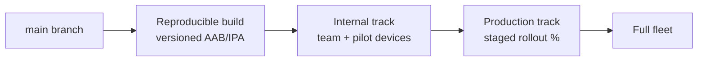

# 08 — Mobile Release Engineering

*Shipping a fleet app to people whose workday stops when the app does.*

## The pipeline

Two tracks minimum — internal testing and production — running **in parallel**: internal carries the next candidate while production carries the current stable. Promotion is a decision, not a rebuild: the artifact that survived internal is byte-identical to what ships (the mobile analog of image-tag promotion on the backend, doc 01).

## Versioning discipline

- **Version code (build number) increments monotonically, every build, no exceptions** — stores enforce it, and humans debugging "which build is that device on?" depend on it. Version name (`6.2.1`) is for humans; version code is for machines.
- One source of truth for both (build script/CI variable), stamped into the app *and* visible in a debug/about screen the field can read to support over the phone.
- Tag the VCS at every shipped build; a fleet incident starts with "what exactly is on that device?" and the tag answers it.

## Signing keys are crown jewels

- The release keystore and its passwords live in a secrets manager / CI secret store — **never in the repo, never in a folder that travels with the repo** (see doc 10 for the wider secrets policy). Anyone holding keystore + passwords can publish malware as your app.
- Enroll in the store's key-management (e.g. Play App Signing) so the upload key is rotatable if leaked; record the certificate SHA-256 fingerprints somewhere findable, since push services and API allow-lists ask for them.
- Losing the key is a different disaster than leaking it: back it up offline, access-controlled, documented.

## On-device schema migrations: the scariest deploy you run

A server migration has one database, a rollback plan, and you watching. A mobile migration runs **on thousands of unattended devices, over weeks, on every OS/storage combination, with unsynced business data in the file**. Rules:

- Migrations are **append-only and forward-only**: version N+1 upgrades from N; never edit a shipped migration step.
- Every migration must be crash-safe mid-flight (transactional per step) — devices power off during upgrades.
- **Never destructive while an outbox is non-empty.** A migration must not drop/rewrite tables that hold unsynced records; drain first or migrate around.
- Test the real path: install build N, create data (including pending outbox items), upgrade to N+1, verify data + drain. Automate this on CI with emulators for the last few Ns; skipping versions happens in fleets (N→N+3 must work).
- Ship a **recovery mode**: a build-flag or hidden mode that can export local data (files/DB) off a stuck device without needing sync to work. When a migration bug ships anyway, this converts "lost week of timesheets" into "emailed a file to support."

## Staged rollout, honest telemetry

- Production rollouts start at a small percentage with crash-rate and sync-health gates before widening (doc 09's mobile metrics feed this).
- Keep a **pilot cohort** of real field users on the internal track permanently — office testing never reproduces field network conditions, cheap devices, or 3-week-old sessions.
- A build is "done" when the fleet's *sync success rate* holds, not when it launches without crashing.

## Platform-target upkeep

Stores ratchet minimum target OS levels annually. Treat the yearly target bump as scheduled engineering with a real test pass — behavioral changes ride on target bumps (permissions, background limits, edge-to-edge UI) and hit exactly the background-sync machinery this architecture depends on. Keep the *minimum* supported OS pinned to the actual fleet's cheapest device, and say no to library upgrades that silently raise it.

## Fleet debugging kit

Ship with the app, gated behind a support unlock (not in end-user reach):

- Structured local logs with a sync-event trail (op id, attempts, last error) — doc 09
- Local DB inspector/export (the recovery mode above)
- Server-selector for staging vs production (pointed at *named environments*, never free-text URLs in release builds)
- "Sync now + report status" one-tap for support calls

## Checklist

- [ ] Parallel internal/production tracks; promote artifacts, never rebuild
- [ ] Monotonic version codes from one source of truth; visible in-app; VCS tag per shipped build
- [ ] Keystore + passwords in secret storage only; store key-management enrolled; fingerprints recorded; offline backup
- [ ] Migrations: append-only, crash-safe, outbox-aware, upgrade-path CI tests incl. version skips
- [ ] Recovery mode able to export local data without working sync
- [ ] Staged rollout gated on crash rate + sync health; permanent field pilot cohort
- [ ] Annual OS-target bump scheduled with a real regression pass; min OS pinned to fleet reality
- [ ] Support-gated debug kit: logs, DB export, environment selector, sync-now
