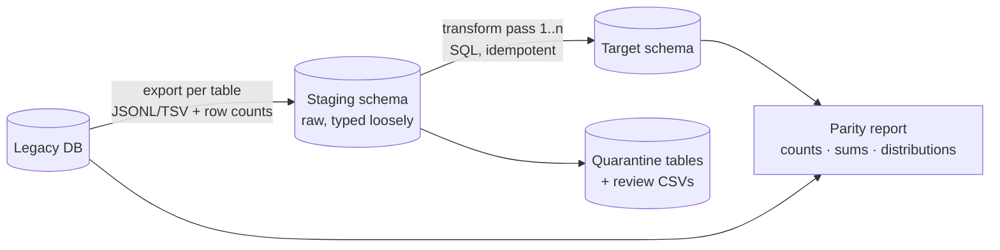

# 11 — Legacy Data Migration Playbook

*Moving years of production records out of a decade-old system, with proofs instead of hope.*

## The setting

The classic modernization: a legacy web stack (think old PHP + MySQL, denormalized tables, business logic in the UI layer) replaced by the platform in doc 01. The old data — customers, work orders, years of timesheets and signed reports — must arrive in the new schema **complete, correct, and provably so**, while the business keeps operating.

## Principles

1. **Migrate in passes, never in place.** Extract → stage → transform → load → verify, each step re-runnable. You will run every pass more than once; design for re-execution from the start (idempotent loads: truncate-and-reload staging, upsert-by-stable-key into targets).
2. **Stable IDs are the spine.** Map every legacy row to the new row via legacy primary keys carried in a `legacy_id` column (or a mapping table) on the target. **Never join on business codes** — document numbers get retyped, reformatted, and duplicated in old systems (doc 05); every mapping built on them will eventually mis-link records. The `legacy_id` also makes re-runs and audits possible at all.
3. **Counts are necessary, not sufficient.** Row-count parity hides transformation bugs. Verify **distributions**: per-tenant, per-year, per-status counts; sums of business quantities (hours, amounts); null-rates per column; min/max dates. A parity report comparing all of these, old vs. new, is the migration's deliverable — alongside the data itself.
4. **Quarantine, don't "fix," garbage.** A decade of production input contains impossible dates, orphaned children, duplicated codes, free-text in numeric fields. Route them to explicit quarantine tables + a human-review export (CSV with legacy id, field, raw value, reason). Silently coercing junk turns data problems into *your* bugs; a review file turns them into the business's decisions.
5. **Everything under version control except the data**: extract queries, transform SQL, load scripts, verification queries, and the runbook — the migration is a program, not a weekend.

## The pipeline

Practical mechanics that earn their keep:

- **Export with manifests:** every extract file ships with its row count and source query; the loader refuses count mismatches. (Verify by counting *records*, not file lines — multi-line payloads make `wc -l` a liar.)
- **Staging is typed loosely** (text-ish), so loads never fail on legacy dirt; *transforms* do the strict typing and route failures to quarantine.
- **Multi-pass transforms:** pass 1 masters (customers, sites, users), pass 2 documents (work orders, reports), pass 3 relationships/backfills. Each pass ends with its own verification block; a failed pass re-runs alone.
- **Normalize the classics** in transforms, with counted rules: date formats (`13.08.26`, `2026/08/13`, epoch ms → ISO; and *timezones made explicit* — legacy naive timestamps get an assumed zone, documented), encodings (mojibake repair), status vocabularies (legacy magic numbers → named states via a mapping table checked into the repo), decimal separators.
- **Sequence/counter sync is a real step:** after loading, set every serial/identity and every business counter (doc 05) above the migrated maximums — the "new system reuses an old document number a week after cutover" bug is entirely preventable and deeply embarrassing.
- **Blob archaeology:** legacy systems love storing a whole form as one serialized blob per page/section. Budget real time for extracting them into columns; where the target app already has canonical field models (the mobile form models, in a field platform), *those* define the extraction target — reverse-engineer the blob into the app's schema, not into a guess.

## Files and binary evidence

Signed PDFs and photos are business records with legal weight:

- Migrate files with **checksums** recorded at both ends; the parity report includes file counts + byte totals per category.
- Re-link files to records via the stable-ID mapping (never by parsing filenames — see principle 2).
- Where the legacy system generated documents on the fly, decide explicitly: regenerate from data in the new engine (and accept pixel differences), or preserve original bytes as immutable artifacts (doc 07's rule: what the customer signed is what you store). Preserve originals for anything signed.

## Cutover

- **Freeze-window cutover per tenant** beats big-bang: migrate a tenant, verify parity, switch that tenant's users, keep the legacy system read-only for reference.
- Rehearse the full pipeline **twice** on production-scale copies before the real run; the second rehearsal is where the timing surprises show up (index-less staging loads, the one table that's 100× the others).
- Take a final legacy backup *and* a pre-load target backup; keep rollback tables (`pre_migration_<table>`) for anything the load updates in place.
- After cutover, the parity report gets a **week-later addendum**: spot-check high-value records (largest invoices, most-active engineers) and reconcile anything users flag. The first month-end close on migrated data is the real acceptance test — staff someone to own discrepancies through it.

## Anti-patterns (each learned the expensive way)

| Anti-pattern | What actually happens |
|---|---|
| Joining old↔new on document numbers | Duplicated/retyped legacy codes silently cross-link unrelated records |
| "We'll clean the data in the new system later" | Later never comes; junk becomes load-bearing |
| One giant transform script | Any failure = start over; nobody can review 3,000 lines of SQL |
| Verifying only row counts | A timezone bug shifts every timestamp 4 hours; counts match perfectly |
| Migrating during live writes without a freeze | Ghost records that exist in neither parity column |
| Skipping sequence sync | New documents collide with migrated codes within days |
| Untracked manual fixes during cutover weekend | The re-run erases them; nobody remembers what they were |

## Definition of done

- [ ] Parity report: counts, sums, distributions, null-rates — old vs new, per tenant, committed to the repo
- [ ] Quarantine review files dispositioned by the business (accepted / fixed / dropped, in writing)
- [ ] Sequences and business counters proven above legacy maxima
- [ ] File checksums verified; signed originals preserved immutably
- [ ] Legacy system read-only, retained per retention policy
- [ ] First month-end close on migrated data completed with owner on point
